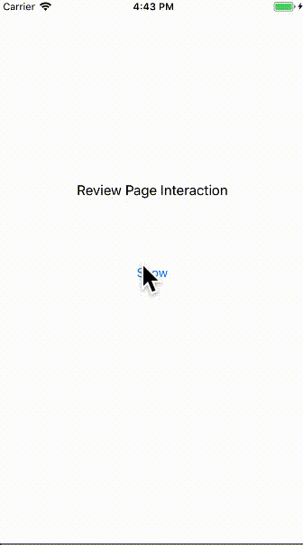

# RPInteraction

[](https://cocoapods.org/pods/RPInteraction)
[](https://cocoapods.org/pods/RPInteraction)
[](https://cocoapods.org/pods/RPInteraction)
[](https://travis-ci.com/nbolatov/RPInteraction)



## Overview

Review page interaction - handy and pretty way to ask for review.
Inspired by [dribbble shot](https://dribbble.com/shots/4332677-Review-Page-Interaction).

## Requirements

* iOS8

## Installation

RPInteraction is available through [CocoaPods](https://cocoapods.org). To install
it, simply add the following line to your Podfile:

```ruby
pod 'RPInteraction'
```

## Usage

```Objective-C
@import RPInteraction;

RPViewController *vc = [RPViewController new];

[vc onConfirmHandler:^(RPRate rate) {
    switch (rate) {
        case RPRateBad:
            titleLabel.text = @"BAD";
            break;
        case RPRateUgh:
            titleLabel.text = @"UGH";
            break;
        case RPRateOk:
            titleLabel.text = @"OK";
            break;
        case RPRateGood:
            titleLabel.text = @"GOOD";
            break;
    }
    [self dismissViewControllerAnimated:YES completion:nil];
}];

[vc onCancelHandler:^{
    [self dismissViewControllerAnimated:YES completion:nil];
}];

[self presentViewController:vc animated:YES completion:nil];
```

### Available properties

Property | Type | Default Value
--- | --- | ---
`rateTitle` | `NSString` | How was your experience with us?
`badTitle` | `NSString` | BAD
`ughTitle` | `NSString` | UGH
`okTitle` | `NSString` | OK
`goodTitle` | `NSString` | GOOD
`confirmTitle` | `NSString` | SUBMIT
`rateTitleFont` | `UIFont` | `[UIFont systemFontOfSize:24]`
`confirmTitleFont` | `UIFont` | `[UIFont systemFontOfSize:24]`
`backgroundColor` | `UIColor` | `#FFFFFF`
`closeIconColor` | `UIColor` | `#656565`
`rateTitleColor` | `UIColor` | `#656565`
`reelTitleColor` | `UIColor` | `#FFFFFF`
`confirmTitleColor` | `UIColor` | `#FFFFFF`
`badTitleColor` | `UIColor` | `#FE5C6E`
`ughTitleColor` | `UIColor` | `#F6BC7E`
`okTitleColor` | `UIColor` | `#28CDFC`
`goodTitleColor` | `UIColor` | `#41F8C7`
`badStartGradientColor` | `UIColor` | `#FE0D46`
`badEndGradientColor` | `UIColor` | `#FEAD96`
`ughStartGradientColor` | `UIColor` | `#F9D975`
`ughEndGradientColor` | `UIColor` | `#F39F86`
`okStartGradientColor` | `UIColor` | `#12E6F9`
`okEndGradientColor` | `UIColor` | `#41B0FD`
`goodStartGradientColor` | `UIColor` | `#3EE882`
`goodEndGradientColor` | `UIColor` | `#3DF9CF`

## Example Project

An example project is included with this repo.  To run the example project, clone the repo, and run `pod install` from the Example directory first.

## Author

nbolatov, nurda.bolatov@gmail.com

## License

RPInteraction is available under the MIT license. See the LICENSE file for more info.
